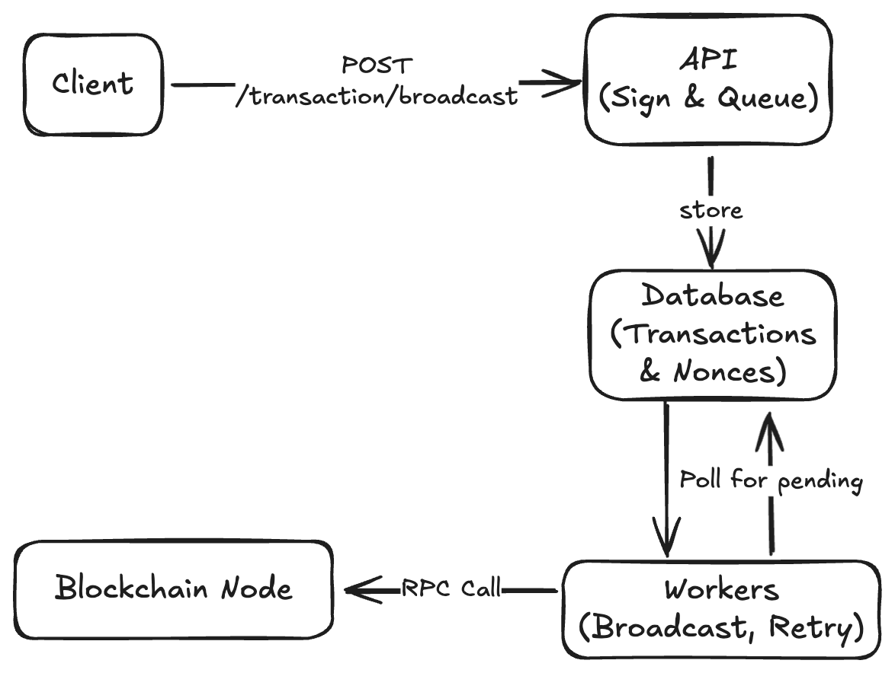

To design a transaction broadcaster service that meets the specified requirements, the service must handle transaction signing, broadcasting with retries, and provide idempotency guarantees. 

## **Architectural Overview**

The system comprises four main components:
1. **API Layer**: Handles incoming requests and initial processing.
2. **Signing Service**: Securely signs transactions with proper nonce management.
3. **Persistence Layer**: Stores transaction states and nonce tracking.
4. **Worker Processes**: Handle transaction broadcasting, retries, and failure recovery.
5. **Admin Interface**: Provides visibility into transaction statuses and manual retries.

## **Component Details**

### **1. API Layer**

- **Endpoint**: `POST /transaction/broadcast` accepts a transaction payload.
- **Validation**: Checks for valid `message_type` and properly formatted `data`.
- **Idempotency**: Generates a unique `transaction_id` (UUID) for each request to prevent duplicates.
- **Response**: Returns `200 OK` once the transaction is persisted and queued. Errors return appropriate HTTP codes.

### **2. Signing Service**

- **Nonce Management**: Uses a database table (`nonces`) to track the next nonce for the service's address. Atomic increments via row locking ensure no duplicates.
- **Signing Process**:
  1. Retrieve and increment the nonce atomically.
  2. Construct the transaction with the nonce.
  3. Sign the transaction using a securely stored private key (e.g., encrypted in a vault).

### **3. Persistence Layer**

- **Database Schema**:
  - **Transactions Table**:
    - `id` (UUID), `data`, `signed_tx`, `status` (`pending`, `processing`, `success`, `failed`), `retry_count`, `next_retry_at`, `error_message`, `nonce`, `created_at`, `updated_at`.
  - **Nonces Table**:
    - `address` (primary key), `next_nonce`.
- **Durability**: All transaction states are persisted to survive restarts.

### **4. Worker Processes**

- **Workflow**:
  1. Poll the database for `pending` or `retry_pending` transactions using `SKIP LOCKED` to avoid conflicts.
  2. For each transaction:
     - **Broadcast**: Send the signed transaction via RPC to the blockchain node.
     - **Retry Logic**: On failure (timeout or error), increment `retry_count`, compute exponential backoff (e.g., 1s, 5s, 25s), and update `next_retry_at`.
     - **Success/Failure Handling**: Update the status to `success` (if RPC returns a transaction hash) or `failed` (after max retries).
- **Scalability**: Multiple workers can run in parallel, polling the database for work.

### **5. Admin Interface**

- **Endpoints**:
  - `GET /admin/transactions`: Lists transactions with filters (status, time range).
  - `POST /admin/transactions/{id}/retry`: Resets a failed transaction to `pending` for reprocessing.
- **UI**: A simple dashboard displaying transaction statuses and allowing manual retries.

## **System Flow**

1. **Client Request**:
   - Client sends a `POST` request to `/transaction/broadcast`.
   - API validates input, generates `transaction_id`, and ensures idempotency.
2. **Signing & Persistence**:
   - The service acquires a nonce, signs the transaction, and stores it in the database with status `pending`.
3. **Queueing**:
   - The transaction is marked as `pending`, and workers pick it up asynchronously.
4. **Broadcasting**:
   - A worker sends the signed transaction via RPC.
   - On success, status is updated to `success`.
   - On failure, retries are scheduled with backoff.
5. **Retries**:
   - Workers retry failed transactions until success or max retries.
   - Admins can manually retry via the admin interface.

## Non-functional Requirement

### **Scalability & Robustness**

- **Horizontal Scaling**: API servers and workers can be scaled independently.
- **Database Optimization**: Indexes on `status`, `next_retry_at`, and `nonce` ensure efficient querying.
- **Node Redundancy**: Configure multiple blockchain RPC endpoints to distribute load and handle node failures.
- **Idempotency**: Unique `transaction_id` prevents duplicate processing.

### **Failure Handling**
- **RPC Timeouts**: Workers use a 30s timeout, retrying on timeout or network errors.
- **Database Atomicity**: Transactions and nonce increments are wrapped in database transactions.
- **Crash Recovery**: On restart, workers resume processing `pending` or `processing` transactions (stale entries are reset based on `updated_at`).

### **Security Considerations**
- **Private Key Storage**: Use HSMs or encrypted secrets (e.g., AWS KMS) to protect keys.
- **API Authentication**: Secure admin endpoints with role-based access control.

## **Diagram**

